<div align="center">

<br>

#  AIMED - AI Monitoring & Execution Dashboard
## Version v0.1.0

*Visual Interface for keeping AI assistants on track and focussed*

<br>

&nbsp;&nbsp;&nbsp;
&nbsp;&nbsp;&nbsp;
&nbsp;&nbsp;&nbsp;


</div>

<br>

## What is AIMED?

**AIMED** (AI Monitoring & Execution Dashboard) is a web interface for [ConPort MCP](https://github.com/GreatScottyMac/context-portal) that provides visual access to project context knowledge used by AI assistants.

**AIMED = ConPort MCP + Web Dashboard**

## Visual Tour

### Dashboard Views

<table>
  <tr>
    <td width="50%">
      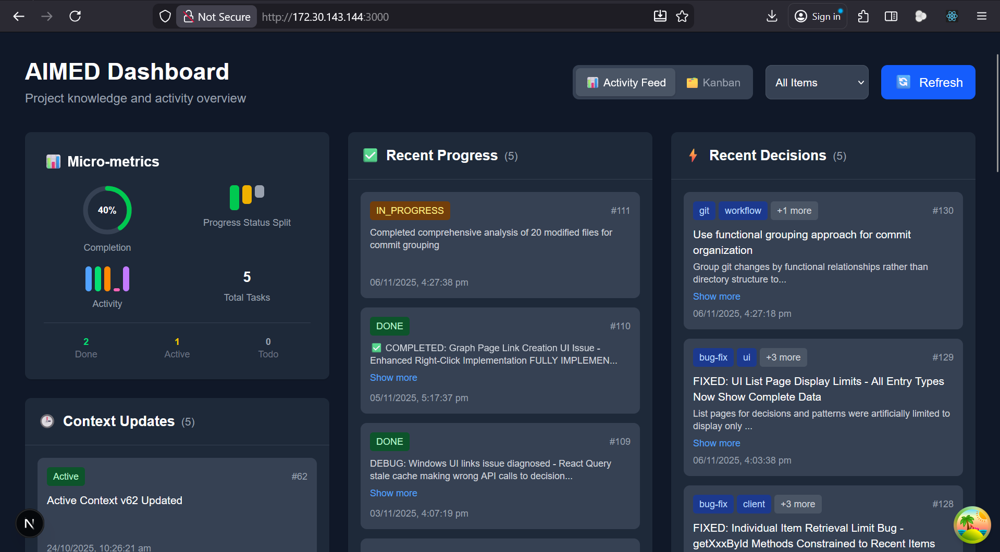
      <p align="center"><em>Activity Feed - Track recent decisions, progress, and context changes</em></p>
    </td>
    <td width="50%">
      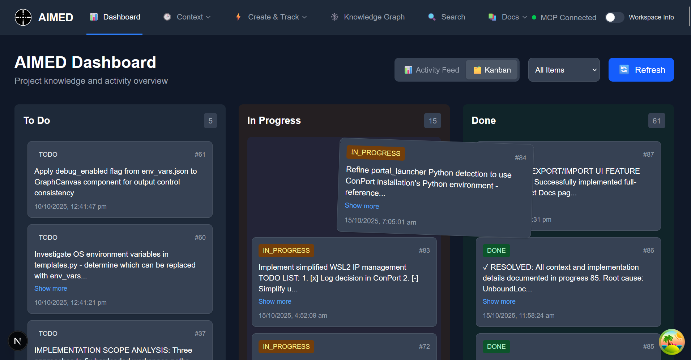
      <p align="center"><em>Kanban Board - Drag-and-drop task management</em></p>
    </td>
  </tr>
</table>

### Knowledge Graph

<table>
  <tr>
    <td width="50%">
      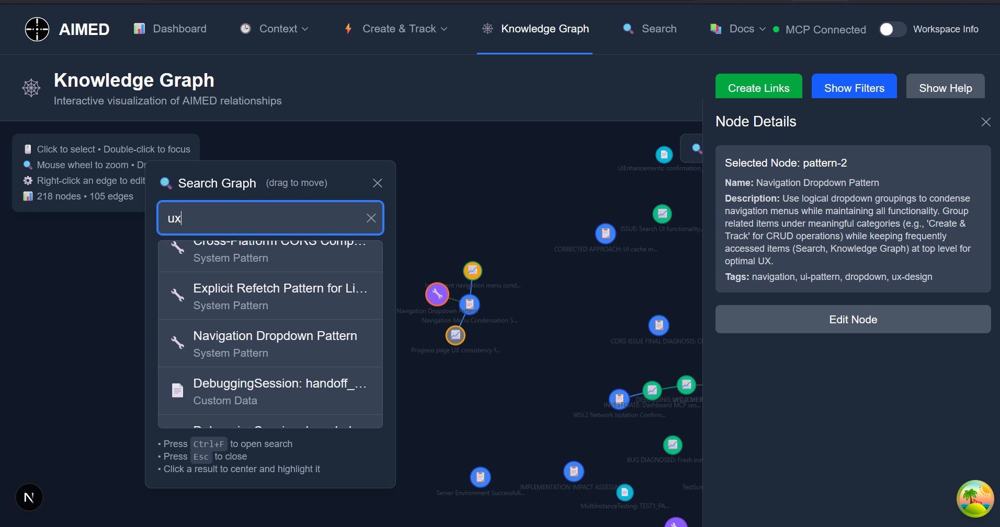
      <p align="center"><em>Interactive Knowledge Graph - Visualize project relationships</em></p>
    </td>
    <td width="50%">
      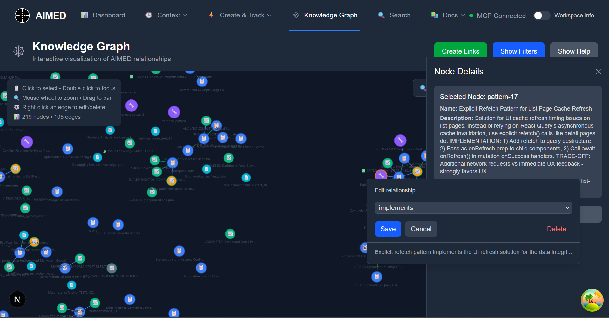
      <p align="center"><em>Edit Relationships - Right-click to modify connections</em></p>
    </td>
  </tr>
</table>

### Context & Documentation Management

<table>
  <tr>
    <td width="50%">
      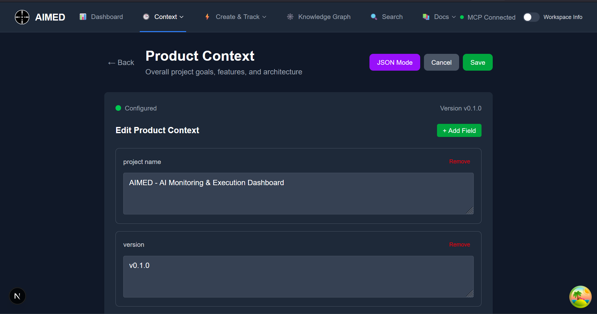
      <p align="center"><em>Context Editor - Manage product and active contexts</em></p>
    </td>
    <td width="50%">
      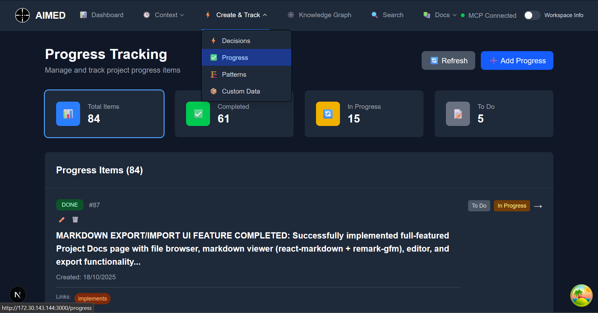
      <p align="center"><em>Entry Management - View and edit all project entries</em></p>
    </td>
  </tr>
  <tr>
    <td width="50%">
      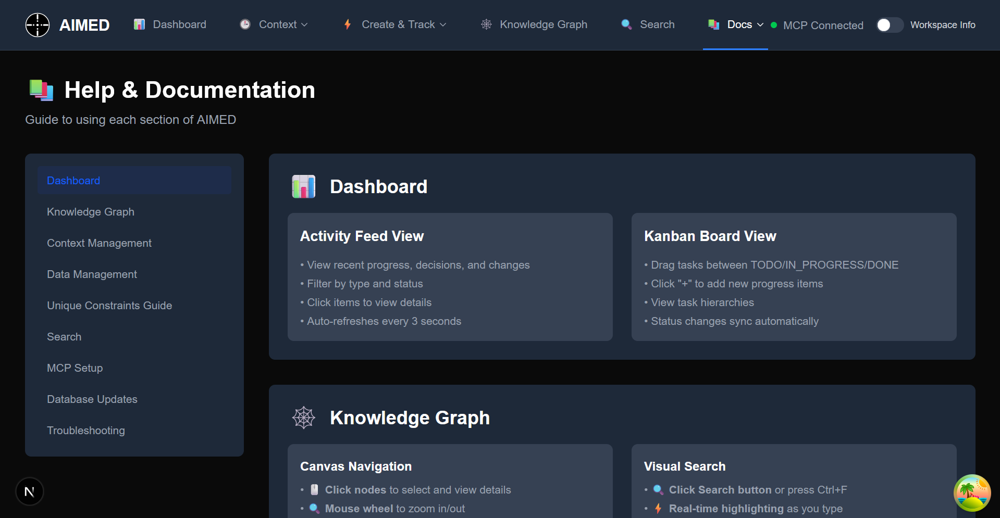
      <p align="center"><em>Documentation Hub - Centralized documentation access</em></p>
    </td>
    <td width="50%">
      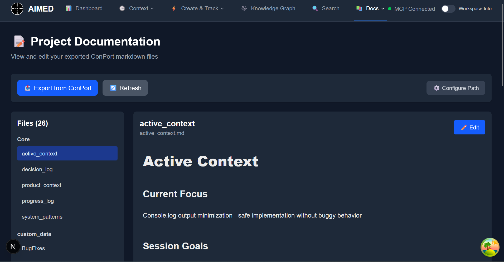
      <p align="center"><em>Auto-Generated Docs - View/edit project documentation files</em></p>
    </td>
  </tr>
</table>

### Workspace Management

<table>
  <tr>
    <td width="50%">
      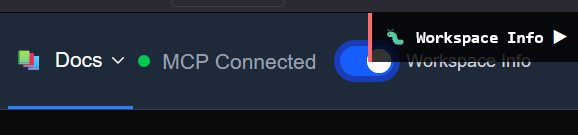
      <p align="center"><em>Workspace Info - Compact view</em></p>
    </td>
    <td width="50%">
      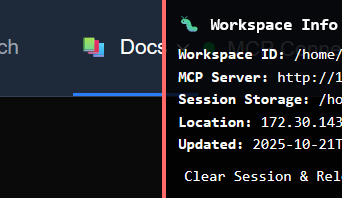
      <p align="center"><em>Workspace Info - Expanded details</em></p>
    </td>
  </tr>
  <tr>
    <td colspan="2">
      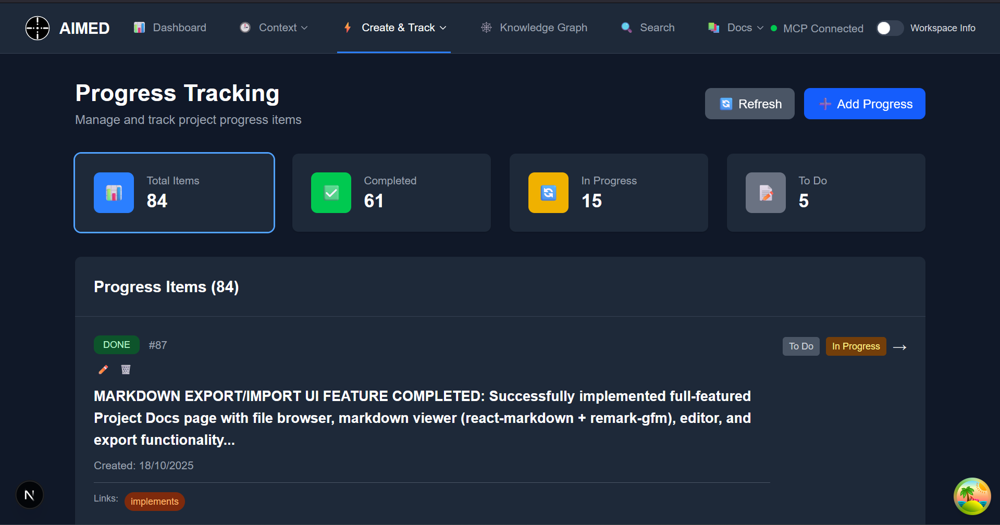
      <p align="center"><em>Progress Tracking - Monitor task completion and status</em></p>
    </td>
  </tr>
</table>

## Key Benefits

- **How does your AI view your project?** Provides insight into what the AI actually sees
- **Reduce AI token costs** by eliminating context baggage and managing what your AI uses
- **Visual knowledge graph** showing relationships between decisions, progress, patterns and custom data
- **Multi-workspace isolation** Ability to work on multiple workspaces at the same time with workspace isolation.

See [AIMED-BENEFITS.md](AIMED-BENEFITS.md) for complete features and capabilities.

## ⚠️ Important: Compatibility with ConPort MCP

**AIMED uses a modified version of ConPort MCP** that enables seamless web interface integration but results in **incompatibility** with the original ConPort MCP server.

**If you're currently using ConPort MCP:** Please temporarily disable/turn off your existing ConPort MCP server in your IDE before running AIMED to avoid conflicts.

**Custom Instructions Required:** Conport and AIMED requires IDE-specific custom instructions for optimal LLM integration. Use the appropriate strategy file from [`conport-custom-instructions/`](conport-custom-instructions/) directory:
- [`roo_code_conport_strategy`](conport-custom-instructions/roo_code_conport_strategy) - For Roo Code extension
- [`cline_conport_strategy`](conport-custom-instructions/cline_conport_strategy) - For Cline extension
- [`cascade_conport_strategy`](conport-custom-instructions/cascade_conport_strategy) - For Windsurf Cascade (full version)
- [`cascade_conport_strategy_compact`](conport-custom-instructions/cascade_conport_strategy_compact) - For Windsurf Cascade (compact version)
- [`generic_conport_strategy`](conport-custom-instructions/generic_conport_strategy) - For other MCP-compatible environments
- [`current_generic_conport_strategy`](conport-custom-instructions/current_generic_conport_strategy) - Trimmed down version of generic_conport_strategy that works well for me :)
- [`mem4sprint.md`](conport-custom-instructions/mem4sprint.md) - Memory and sprint management strategy
- [`mem4sprint.schema_and_templates.md`](conport-custom-instructions/mem4sprint.schema_and_templates.md) - Schema and templates for memory management

Copy the entire content of the relevant strategy file into your LLM's custom instructions.

Feel free to use these as a base for your own custom instructions.

## Quick Start

See [Installation Guide](INSTALLATION_GUIDE.md) for complete setup instructions.

### Basic Steps

1. **Clone repository and install dependencies**
   ```bash
   git clone https://github.com/drew1two/AIMED.git
   cd AIMED
   # Python setup (see installation guide)
   # Node.js setup (see installation guide)
   ```

2. **Configure MCP client in your IDE**
   - Add ConPort MCP server configuration
   - See installation guide for platform-specific examples

3. **Launch dashboard**
   ```bash
   python context_portal_aimed/portal_launcher.py
   ```
   Opens ConPort MCP server (port 8020) and web UI (port 3000)

**Architecture**: AIMED uses a modified version of ConPort MCP which is the equivalent of Conport MCP v0.3.4. It creates `context_portal_aimed/` directory for workspace isolation. Each project runs independent server instances with separate port allocation.

## Features

### Web Dashboard
- Activity feed showing recent decisions, progress, and context changes
- Kanban board for task management with drag-and-drop functionality
- Interactive knowledge graph displaying project element relationships
- Context editors for product and active project contexts
- Search interface with full-text and semantic search capabilities
- CRUD interfaces for decisions, progress items, system patterns, custom data

### Backend (ConPort MCP)
- SQLite database with automatic schema migrations
- Model Context Protocol server for AI assistant integration
- Multi-workspace isolation with per-project databases
- Vector embeddings for semantic search
- Full-text search with FTS5
- Knowledge graph with explicit relationship tracking

## Technical Details

- **Frontend**: Next.js 14 with TypeScript, TailwindCSS, TanStack Query
- **Backend**: FastAPI server with FastMCP integration
- **Database**: SQLite with Alembic migrations
- **Search**: FTS5 full-text search + vector embeddings
- **Architecture**: Multi-workspace isolation with port-based routing

## Attribution and License

AIMED extends [ConPort MCP](https://github.com/GreatScottyMac/context-portal) by GreatScottyMac under the Apache License 2.0.

- **ConPort MCP**: Copyright © 2025 GreatScottyMac and contributors
- **AIMED Visual Extensions**: Copyright © 2025 AIMED Contributors
- **Current ConPort equivalent**: v0.3.4

Both the original ConPort MCP and AIMED visual extensions are licensed under Apache 2.0. See [NOTICE](NOTICE) for complete attribution details.

## Documentation

- [Installation Guide](INSTALLATION_GUIDE.md) - Complete setup instructions
- [Tips & Tricks](TIPS_AND_TRICKS.md) - Best practices for working with AI assistants
- [Release Notes](RELEASE_NOTES.md) - Version history
- [AIMED Benefits](AIMED-BENEFITS.md) - Complete features and capabilities

## Support

- [GitHub Issues](https://github.com/drew1two/AIMED/issues) - Bug reports and feature requests
- [GitHub Discussions](https://github.com/drew1two/AIMED/discussions) - Community Q&A

Licensed under [Apache-2.0](LICENSE).
